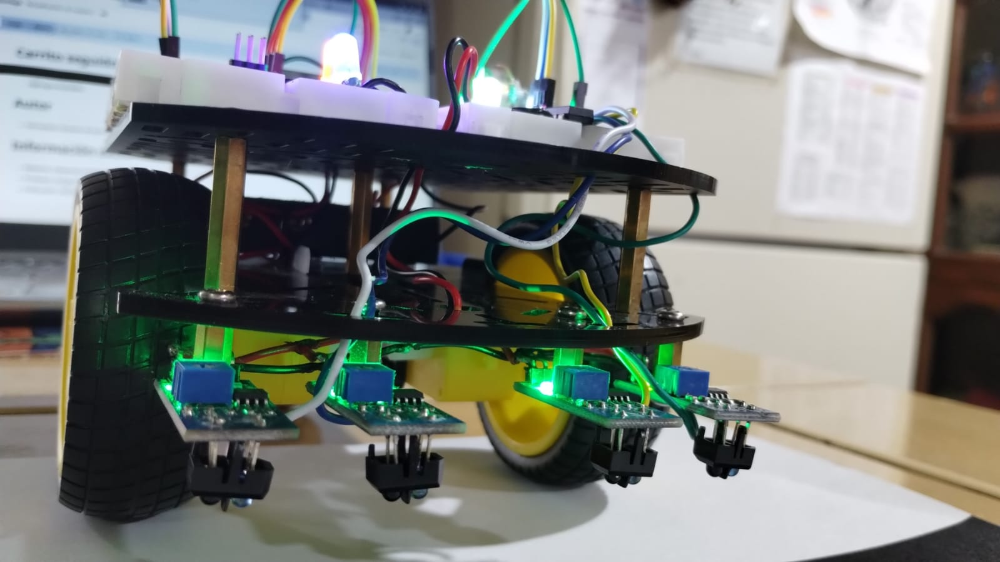
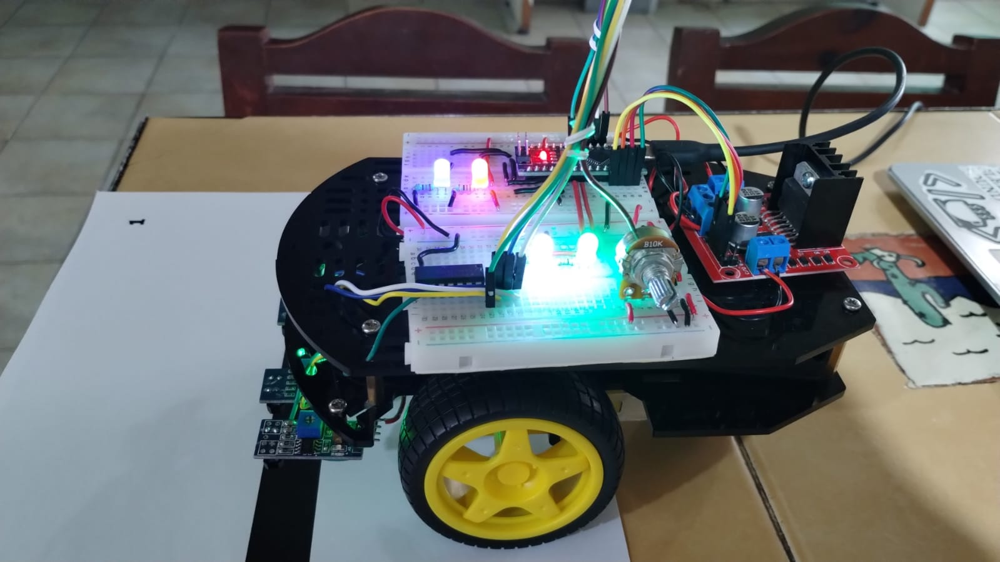
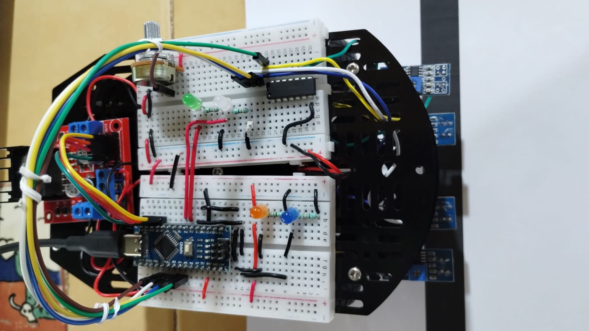
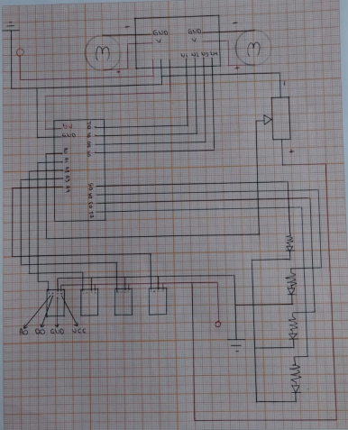

# Carrito seguidor de lineas
- Algoritmo para un carrito seguidor de lineas, con 4 sensores y un potenciometro para calibrar el umbrar sin necesidad de estar reprogramandolo.

# Autor
- Fernando Octavio Arroyo Velasco

# Información extra
- Materia: Sistemas embebidos
- Profesor: Jorge Enrique Wals Selvas
- Intitución: UACM (Universidad Autonoma de la Ciudad de México)

# Componentes 

- 1 Arduino NANO
- 1 Modulo L298N
- 4 Sensores infrarrojos
- 1 Potenciómetro 10K 
- 4 led de colores (Azul, Naranja, Verde, Blanco)
- Alambre negro y rojo (1 o 2 mtros)
- 5 Dupont Jumpers 
- 4 Resistencias de 330 OMS
- Porta pilas 4xAA

# Imagenes del proyecto

# Diagrama del proyecto 

